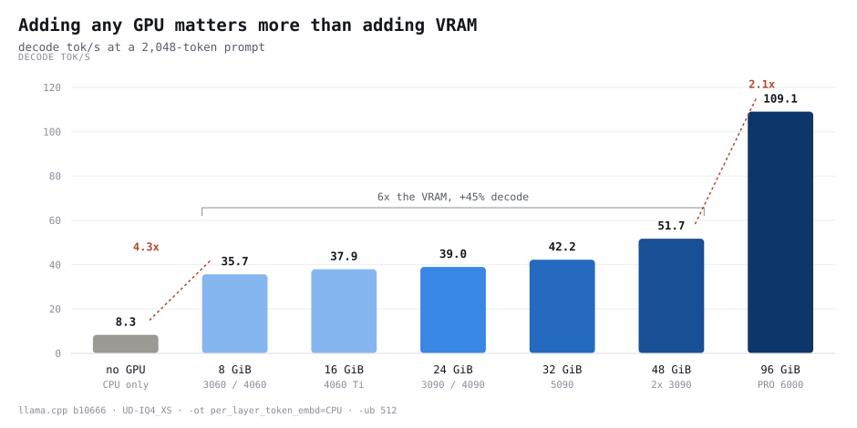
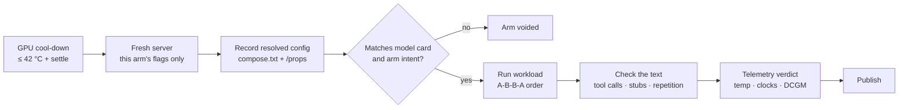
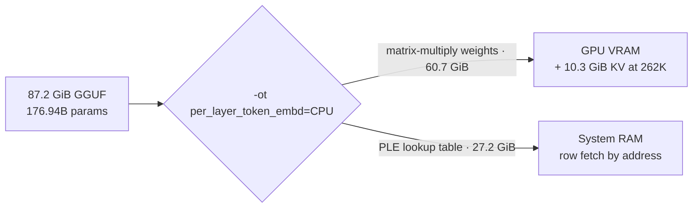
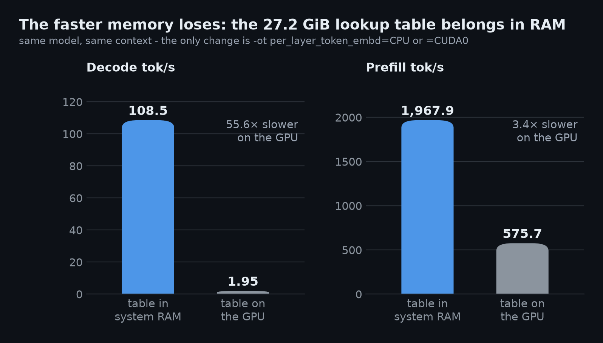
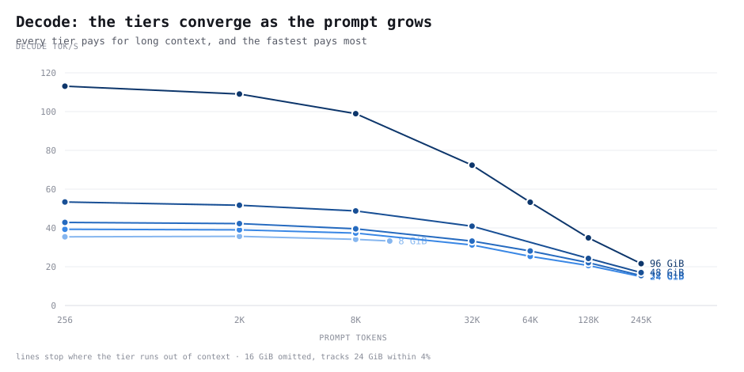
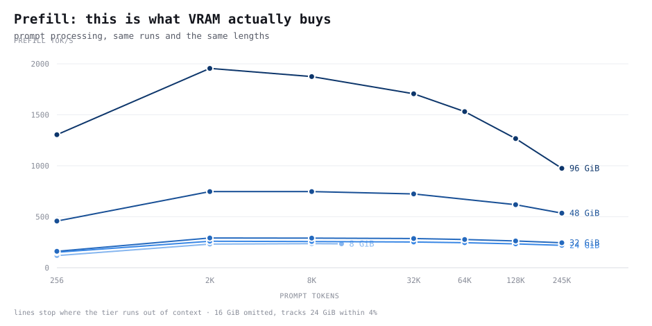
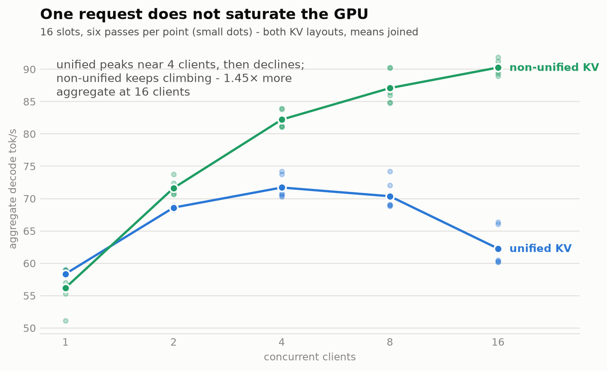

# Qwen3.8-Flash-Next on one RTX PRO 6000

Qwen3.8-Flash-Next (125B MoE, 6B active) on a single RTX PRO 6000 with 96 GB of
system RAM, in llama.cpp. **51.2B of its 176.94B parameters are a lookup table,
not matrix-multiply weights.** Put that table in system RAM and the model runs
on an 8 GB card — or on no GPU at all.

Short answers: putting the lookup table on the GPU instead is **55.6× slower**
to decode. The largest free speed lever is not the card, it is
`--load-mode none`, worth **1.87× prefill** at identical tensor placement. The
model reaches **36 tok/s on an 8 GB card** and **8.5 tok/s with no GPU**. A
larger microbatch buys **+30.8% prefill for about 1 GiB of VRAM**.

<picture>
  <source media="(prefers-color-scheme: dark)" srcset="assets/ladder_decode_dark.svg">
  
</picture>

The full write-up, with a diagram per result and every limit stated, is
[`report.html`](report.html) — open it in a browser.

We discuss it here: [reddit thread - link TBD]

## YouTube

LOCAL AI SERIES:

- **NEW:** Qwen3.8-Flash-Next 125B on one RTX PRO 6000 — and on an 8 GB card [link TBD]
- DeepSeek V4 Flash 284B on a single RTX 6000 PRO with DSpark https://youtu.be/EDls1Popv1o
- Fastest Qwen 3.8 27B in Llama.cpp? DFlash 2 + n-gram Explained & Benchmarked! https://youtu.be/RBlRTUwJMI4
- Up to 8x Faster AI N-gram Explained, Deployed & Benchmarked on Qwen 3.6 27B llama.cpp! https://youtu.be/zNUoHONUHGk
- Up to 6x Faster AI? DFlash Explained, Deployed & Benchmarked on Qwen 3.6 27B llama.cpp! https://www.youtube.com/watch?v=TUdihA_dJjo

## Hardware

All numbers are measured on a single card, one server at a time:

| | |
|---|---|
| **GPU** | NVIDIA RTX PRO 6000 Blackwell (sm_120), 96 GB VRAM (~92 GB usable) |
| **CPU** | AMD Ryzen 9 9950X, 16 cores / 32 threads |
| **RAM** | 96 GB DDR5 dual channel (~91 GB usable) |
| **llama.cpp** | `ghcr.io/ggml-org/llama.cpp:server-cuda13`, build `b10666` (`4e97ac86e`). qwen4exp support landed upstream in `6c84c7d5d`, first tagged build `b10658` |
| **Model** | `unsloth/Qwen3.8-Flash-Next-GGUF:UD-IQ4_XS`, 87.2 GiB, 176.94B total parameters |
| **GPU layout** | single GPU, `-ngl 999`, `-ot per_layer_token_embd=CPU`, no tensor split |
| **Raw baseline** | **109 tok/s** decode, **1,955 tok/s** prefill at a 2,048-token prompt |

## Quick start

```bash
./scripts/download_models.sh          # UD-IQ4_XS, 93.7 GB, resumable, sha256-verified
./scripts/serve.sh                    # pulls the image on first run, waits for health
curl -s localhost:8000/health
```

No local engine build is needed. The upstream image carries qwen4exp support,
and compose pulls it if it is not already present.

`serve.sh` wraps `docker/docker-compose.yaml` and resolves the HuggingFace
cache path for you:

```bash
./scripts/serve.sh --print                       # show resolved config, start nothing
./scripts/serve.sh --ctx 262144                  # full native context
./scripts/serve.sh --n-cpu-moe 42 --ctx 262144   # 24 GB-class card
./scripts/serve.sh --spec ngram-mod              # speculative arm
./scripts/serve.sh --down
```

---

# How every test is run

The rules come first, because a number without its method is not a result.

- **Scores come from saved files.** Every request writes a result row to disk.
  Each score is computed from those rows by a recorded command. Scores are
  never copied from terminal output.
- **We read the logs and check the generated text.** A checker flags runs where
  the model did not do the workload: tool calls with no executor, stub answers,
  missing code, truncated turns. This matters — three early runs reported
  plausible speeds (158, 98 and 105 tok/s) while the model only emitted
  tool-call syntax and wrote no code. Speed alone cannot show that.
- **One fresh server per arm, with a cooldown.** A settle routine waits for the
  previous arm's VRAM to be released and for the card to cool to 42 °C or less,
  then holds a floor delay. A hot card clocks lower, so back-to-back arms would
  measure order, not configuration.
- **We repeat and reverse the order.** Two-configuration tests run A-B-B-A, and
  the order effect is reported — 0.56% for the placement test.
- **The GPU is monitored during every arm.** Temperature, power, clocks and
  throttle flags per arm; DCGM profiling counters for tensor-pipe, GPU-memory
  and PCIe activity. A thermal throttle voids the arm.
- **The sampler must match the mode**, checked against the model card before
  each workload test.
- **Every option is asserted before the run** — tensor placement, context,
  expert offload, microbatch, batch, parallel slots, GPU layers, loading mode,
  lazy reads, KV layout. A mismatch fails the arm before any request is sent.

Every arm walks the same pipeline:



### Sampler values, from the model card

| Parameter | Thinking | Non-thinking |
|---|---:|---:|
| Temperature | 1.0 | 0.7 |
| top-p | 0.95 | 0.80 |
| top-k | 20 | 20 |
| min-p | 0.0 | 0.0 |
| Presence penalty | 0.0 | 1.5 |
| Repetition penalty | 1.0 | 1.0 |

### The five workloads

No test uses live traffic. Every run of a test sees the same input.

| Workload | What the model receives | Used by |
|---|---|---|
| Speed sweep | Real code-problem text (101 LiveCodeBench problems) cut to exact prompt lengths, 256 → 245,760. Greedy, fixed output length, prompt cache off | ladder, placement, load mode, microbatch, quant |
| llama-bench | The tool's own built-in tests (pp512, pp4096, tg128) | ladder cross-check |
| Coding conversation | Fixed requests that build one app step by step, as one growing conversation. Model-card sampler | speculation, preserved reasoning |
| Concurrent load | Unique ~4,000-token prompts, exactly 256 output tokens, cache off, 1–16 at once | concurrency |
| Recall document | Generated document up to 245,760 tokens with three planted facts at three depths, graded by exact checkers | long-document recall |

### Why not greedy sampling for workload tests

Greedy (temperature 0, top-k 1) promises identical output between arms. On this
engine it does not deliver that: with speculation as the only difference, output
diverged on the first turn. Speculation verifies several tokens per forward
pass, so the arithmetic batches differently and a near-tie token choice can
flip. Workload tests therefore compare decode rates under the model-card
sampler. Fixed-length synthetic sweeps still use greedy with a pinned output
length, where the sampler cannot change how much work is done.

---

# Results

Machine-readable evidence is under [`results/`](results/); each test names its
directory below. [`results/CONFIGS.md`](results/CONFIGS.md) lists the exact
server configuration of every one of the 42 server starts, generated from the
saved artifacts.

## The lookup table belongs in system RAM

Most model weights feed large matrix multiplications. The PLE table is
different: for each token the model fetches a few small rows by address, with no
matrix multiply.



| Part | Params | Size | Fast placement |
|---|---|---|---|
| Expert weights | ~120 B | 60.7 GiB | GPU VRAM |
| **PLE lookup table** | **~51 B** | **27.2 GiB** | **System RAM (CPU)** |
| 262,144-token context | — | 10.3 GiB | GPU VRAM |

*How it runs:* four server starts in A-B-B-A order; the only change is
`per_layer_token_embd=CPU` or `=CUDA0`. One warm-up and three measured requests
at a 2,048-token prompt, context 32,768 in both arms (the GPU placement does not
fit 262,144 with all expert layers on the card).

<picture>
  <source media="(prefers-color-scheme: dark)" srcset="assets/ple_placement_dark.png">
  
</picture>

| PLE placement | GPU memory | Host memory | Prefill tok/s | Decode tok/s |
|---|---|---|---|---|
| System RAM / CPU | 63,407 MiB | 27.2 GiB | 1,967.9 | **108.5** |
| CUDA0 / GPU | 90,927 MiB | 0.4 GiB | 575.7 | 1.95 |

**Decode is 55.6× slower with the table on the GPU**; prefill 3.4× slower. The
memory columns prove the placement moved. Decode pays a per-step CPU↔GPU cost on
every token, so it slows 55.6×; prefill batches many tokens per step and slows
only 3.4×.

`results/corrections/20260830T145932Z_PLE-01/`

## What it runs like on the card you own

VRAM is software-limited to reproduce smaller cards' capacity, not their
bandwidth. Expert layers move to system RAM until the model and that tier's
largest servable context fit.

| Usable VRAM | Closest setup | Expert layers in RAM | Loading | Prefill 2K | Decode 2K | Long-context decode |
|---|---|---|---|---|---|---|
| None | CPU only | all | mmap | 183 | **8.3** | — |
| 8 GiB | 3060 / 4060 | 48 of 48 | mmap | 232 | 35.7 | — (16K max) |
| 16 GiB | 4060 Ti / 5060 Ti | 45 of 48 | mmap | 249 | 37.9 | 20.6 @ 123K |
| 24 GiB | 3090 / 4090 | 42 of 48 | mmap | 260 | 39.0 | 14.9 @ 245K |
| 32 GiB | 5090 | 36 of 48 | mmap | 292 | 42.2 | 15.4 @ 245K |
| 48 GiB | 2× 3090 | 23 of 48 | RAM resident | 747 | 51.7 | 17.0 @ 245K |
| 96 GiB | this card | 0 of 48 | RAM resident | **1,955** | **109.1** | 21.6 @ 245K |

**Not every tier can use the same loading mode.** The 8–32 GiB tiers offload so
many expert layers that resident loading would need more system RAM than this
machine has, so they use mmap. Only 48 and 96 GiB run `--load-mode none`.

**The tiers converge as the prompt grows.** At 2,048 tokens the 96 GiB tier
decodes 2.8× faster than the 24 GiB tier; at 245,760 tokens the lead is 1.45×.
Long context costs every tier, and the fastest tier most.

<picture>
  <source media="(prefers-color-scheme: dark)" srcset="assets/ladder_vs_context_dark.svg">
  
</picture>

**Prefill is what the VRAM actually buys.** At a 2K prompt the 96 GiB tier
processes prompts 8.4x faster than 8 GiB, against 3.1x for decode. Prompt
processing runs every weight through the GPU, so resident layers do
compute-bound work; decode only streams the ~2.4B active expert parameters per
token, which system RAM can feed. Your GPU buys reading speed; your RAM decides
whether the model runs at all.

<picture>
  <source media="(prefers-color-scheme: dark)" srcset="assets/ladder_prefill_dark.svg">
  
</picture>

`report.html` has the per-tier charts, all 38 measured points with TTFT, and the
llama-bench cross-check. `results/tier_full/`, `results/cpu_only/`. The charts
above are generated from that CSV by `benchmark/make_charts.py` - rerun it after
any new measurement rather than editing the SVGs.

16 GiB is omitted from the two line charts for legibility; it tracks 24 GiB
within 4%. Five is also the most steps the blue ordinal ramp holds while keeping
adjacent tiers distinguishable.

## Loading mode: mmap or RAM resident

*How it runs:* the 48 GiB tier again, identical tensor placement, context and
microbatch — only the loading method changes. mmap runs cold and again warm.

| Prompt tokens | RAM resident | mmap 1st | mmap 2nd | 2nd vs resident |
|---|---|---|---|---|
| 2,048 | 746.7 | 394.9 | 405.8 | 54% |
| 8,192 | 747.2 | 407.4 | 392.3 | 52% |
| 32,768 | 723.9 | 405.9 | 404.3 | 56% |
| 131,072 | 618.5 | 365.5 | 366.2 | 59% |

The ladder shows a 2.6× prefill step between 32 and 48 GiB. Two things change
there: VRAM and loading mode. Separated: **resident loading is 1.87×, more VRAM
is 1.39×**, and 1.39 × 1.87 = 2.60 — the whole step. Decode is unaffected by
loading mode (ratio 0.998).

Before buying more VRAM, check whether the machine has enough free system RAM
to use `--load-mode none`.

`results/mmap_control_p1/`, `results/mmap_control_p2/`,
`results/corrections/20260830T151444Z_LOAD-01/`

## Microbatch size

*How it runs:* only `-ub` changes — 256, 512, 1,024, 2,048 — ascending then
descending, fresh server each time, context 32,768, no expert offload.

| Microbatch | Prefill tok/s | Decode tok/s | GPU memory | vs 512 |
|---|---|---|---|---|
| 256 | 1,555.5 | 108.66 | 63,231 MiB | −21.1% |
| 512 | 1,972.3 | 108.50 | 63,407 MiB | baseline |
| 1,024 | 2,324.1 | 109.07 | 63,759 MiB | +17.8% |
| 2,048 | **2,579.3** | 109.02 | 64,465 MiB | **+30.8%** |

Prefill-only: decode spans 0.8% across the sweep. Returns diminish (+26.8%,
+17.8%, +11.0%), so most of the gain is in by 1,024. The cost is 1,058 MiB from
512 to 2,048 — free on this card, but on a small card that memory competes with
context and expert layers.

`results/corrections/20260830T180949Z_UB-01/`

## n-gram speculation

*How it runs:* the same three-turn coding conversation in thinking mode with the
model-card sampler; four pairs with alternating order, fresh server per arm,
output text checked per arm. Score = total generated tokens ÷ total decode time.

| Configuration | Run 1 | Run 2 | Run 3 | Run 4 | Mean |
|---|---|---|---|---|---|
| Baseline | 79.7 | 91.1 | 86.8 | 81.5 | 84.8 |
| ngram-mod | 89.3 | 89.6 | 91.9 | 91.5 | **90.6** |
| Draft acceptance | 43.2% | 41.6% | 35.1% | 28.2% | — |

**About +7%** (84.8 → 90.6 tok/s), 95% CI on the difference +0.6 to +11.0 tok/s.
Real but not large, and four runs per arm leave it imprecise. No DFlash or MTP
draft model exists for this model; this is n-gram speculation only.

`results/corrections/20260830T171252Z_SPEC-01-rate/`,
`results/corrections/20260830T182917Z_SPEC-01-rate/`

## One request does not saturate the GPU

Tensor-pipe activity runs 0.9% (8 GiB) to 13.3% (96 GiB); SM activity reaches
69% at 96 GiB. Neither the tensor pipeline nor the memory interface saturates.

*Concurrency:* two KV-cache layouts at the same total context (131,072) and the
same 16 slots — one shared pool, or 8,192 tokens per slot. Two server starts per
layout, three sweeps each, so every cell is the mean of six samples.

<picture>
  <source media="(prefers-color-scheme: dark)" srcset="assets/concurrency_dark.png">
  
</picture>

| Requests at once | Unified KV | Non-unified KV |
|---|---|---|
| 1 | 58.4 ± 0.4 | 56.2 ± 2.9 |
| 2 | 68.6 ± 0.3 | 71.6 ± 1.2 |
| 4 | 71.7 ± 1.8 | 82.2 ± 1.3 |
| 8 | 70.4 ± 2.2 | 87.1 ± 2.5 |
| 16 | 62.3 ± 3.0 | **90.3 ± 1.1** |

The shape matters more than the ratio: **unified peaks around 4 concurrent then
declines; non-unified keeps climbing to 16**, where it is 1.45× faster in
aggregate. At one or two requests the layouts match within noise — the
difference only appears under load. Individual requests slow either way, from
~104 tok/s at one to 10–12 tok/s at sixteen.

`results/corrections/20260830T193552Z_CONC-01/`

## Preserved reasoning — an early look

Both arms run in thinking mode with the model-card sampler. The flag controls
one thing: whether earlier turns' reasoning is sent back in later prompts. The
model still generates reasoning every turn in both arms.

| | Keep prior reasoning | Drop prior reasoning |
|---|---|---|
| Prompt tokens recomputed | **267** | 18,403 |
| Prompt tokens from cache | 132,972 | 18,183 |
| Turn-5 prompt length | 63,223 | 18,387 |
| Decode, turn 1 → 5 | 110.2 → 48.9 | 96.0 → 65.5 |

Keeping reasoning makes the history append-only, so the server recomputes almost
nothing — **69× fewer prompt tokens**. But the prompt grows to 63,223 tokens by
turn 5 and decode ends 25% lower. **One run per arm, so this is a direction, not
a magnitude.** More measurement is planned; the result will go in the comments
under the video.

`results/corrections/20260830T200958Z_THINK-01/`

## Long-document recall after server reuse

*How it runs:* three facts are hidden in a long generated document — an access
code, a number a later sentence corrects, and a date among decoys — at three
depths. The model is asked to find each one. Then one different large request
goes to the same server. Then the same questions are asked again. Exact
checkers grade every answer, and the checkers were first proven able to fail.

| Document length | Before other work | After other work |
|---|---|---|
| 32,768 (1 and 4 slots) | 36/36 | 36/36 |
| 131,072 | 9/9 | 9/9 |
| 245,760 | 9/9 | 9/9 |
| **Total** | **54/54** | **54/54** |

Every answer stayed correct. An upstream project reported recall errors in a
similar situation on a different GPU backend; that behavior did not appear here
on CUDA.

`results/slot_reuse/`

## Quant comparison

| | UD-IQ4_XS | UD-Q4_K_XL |
|---|---|---|
| Size | 87.2 GiB | 103.7 GiB |
| Decode @2K | **109.1** | 105.4 |
| Configured context | **262,144** | 32,768 |
| Largest tested prompt | 245,760 | 24,576 |

Q4_K_XL costs 3.4% decode for 19% more model and reduces the context this card
can hold. Its real context ceiling was not probed. Output quality was not
measured for either quantization.

`results/q4kxl/`

## The configuration that matters

```bash
-ot per_layer_token_embd=CPU   # the 27 GiB lookup table.
                               # On the GPU instead: 55.6x slower.
--load-mode none               # copy host-side weights into RAM instead of mmap:
                               # 1.87x prefill here. Needs room in system RAM.
--tensor-read-lazy off         # 'auto' silently streams any tensor >4 GiB from
                               # disk. The largest PLE tensor is ~25 GiB.
--n-cpu-moe N                  # expert layers kept in system RAM.
                               # 0 at 96 GiB VRAM; all 48 at 8 GiB VRAM.
-ub 2048                       # +30.8% prefill vs 512 for +1,058 MiB, measured.
                               # Use 1024 (+17.8%, +352 MiB) if VRAM is tighter.
--parallel 1                   # one user. For 8+ concurrent users prefer the
                               # non-unified KV layout.
```

## Benchmarks — run them yourself

```bash
./benchmark/tier_full.sh              # the hardware ladder
./benchmark/mmap_control_v2.sh        # loading mode, cold and warm
./benchmark/cpu_only.sh               # no GPU at all
./benchmark/slot_reuse_long.sh        # long-document recall
uv run benchmark/slot_reuse.py --selftest     # checkers must be able to fail

./benchmark/correction_run_v2.sh --execute --plan-id CORRECTION-R1 --only PLE-01
./benchmark/correction_run_v2.sh --execute --plan-id CORRECTION-R1 --only UB-01
./benchmark/spec01_rate.sh --execute --plan-id CORRECTION-R1
./benchmark/conc01.sh   --execute --plan-id CORRECTION-R1
./benchmark/think01.sh  --execute --plan-id CORRECTION-R1
```

Each controller prints its plan and exits unless given `--execute` and the plan
id. Every sweep calls `gpu_settle()` between arms: it waits for the previous
arm's VRAM to be released and for the card to cool, then holds a floor delay.

## What this does not prove

- **Capping VRAM reproduces capacity, not bandwidth.** A 24 GiB cap on this
  Blackwell card overstates a real 3090 (~1.6 TB/s vs 936 GB/s). The 5090 row is
  the one fair proxy; multi-GPU rows are an optimistic upper bound.
- **Most long-context cells are a single run.** Short-prompt arms repeat to 0.2%
  decode and 0.7% prefill, but a 245,760-token cell costs ~18 minutes and ran
  once.
- **The mmap penalty is measured, not explained.** The two mmap passes agree
  within 0.5%, so the file cache is not the obvious cause. A background download
  ran during that control at ~54 MiB/s; both passes shared it.
- **The recall test restarts the server once per document length.** Only the
  first probe after each start runs on a never-used server.
- **The speculation gain is ~+7% with a wide interval** (+0.6 to +11.0 tok/s,
  95%) from four runs per arm. Draft acceptance also declined across runs, 43%
  → 28%, unexplained.
- **The preserved-reasoning comparison is one run per arm** — direction and
  mechanism, not a settled magnitude.
- **The microbatch sweep covered one configuration:** context 32,768, no expert
  offload, this card.
- **Quant quality was never measured.** IQ4_XS versus Q4_K_XL is speed and reach
  only.

## Repo layout

```
scripts/download_models.sh   sequential, resumable, sha256-verified. aria2c, not
                             `hf download`, which cannot resume.
scripts/serve.sh             quant name -> cache path -> server.
docker/docker-compose.yaml   one service; SPEC_TYPE, OT, LAZY, KV_UNIFIED, NGL,
                             UBATCH, N_CPU_MOE, PARALLEL.
benchmark/                   the harnesses and controllers. See benchmark/README.md.
docs/                        operational notes: GPU monitoring and cooldown,
                             the run lifecycle and locking, a one-line test map.
results/                     saved evidence for every published number.
assets/                      the README charts. Regenerate with
                             `uv run benchmark/plot_results.py`.
report.html                  the full write-up, with diagrams and limits.
```

## References

Model and weights:

- Qwen3.8-Flash-Next: https://huggingface.co/Qwen/Qwen3.8-Flash-Next
- Official announcement: https://qwen.ai/blog?id=qwen3.8-flash-next
- Official repo: https://github.com/QwenLM/Qwen3.8-Flash-Next/
- Unsloth GGUFs: https://huggingface.co/unsloth/Qwen3.8-Flash-Next-GGUF
- llama.cpp qwen4exp support, merged as `6c84c7d5d`; first tagged build `b10658`
- Independent quality benchmarks: https://artificialanalysis.ai/models/qwen3-8-flash-next

Architecture and prior art:

- Qwen Team — *On the Design of Qwen3.8-Next Architecture: Evaluation, Efficiency,
  and Training Stability* (2026) —
  [tech_report.pdf](https://github.com/QwenLM/Qwen3.8-Flash-Next/blob/main/tech_report.pdf).
  Source for the GDN equations, Qwen Sparse Attention, the gated residual, and
  the 51.2B-parameter n-gram embedding table — the tensor llama.cpp names
  `per_layer_token_embd` and this study calls the PLE table.
- SGLang team — *Qwen3.8-Flash-Next: Day-0 Support in SGLang* (2026-08-26) —
  https://www.lmsys.org/blog/2026-08-26-qwen-flash-next.
  The host-RAM PLE path on datacenter GPUs: weights 83.91 → 60.45 GiB per GPU
  (−23.46 GiB), KV capacity 1.84M → 3.28M tokens (+78.54%), throughput −0.07%.
  This study measures the same placement question on one consumer-class card.
- Yang, Kautz & Hatamizadeh — *Gated Delta Networks: Improving Mamba2 with Delta
  Rule* (ICLR 2025) — https://arxiv.org/abs/2412.06464. Background for the gated
  delta rule: decay plus targeted memory correction. 36 of this model's 48
  blocks are gated-delta-net layers.

Previous studies in this series:

- DeepSeek V4 Flash + DSpark: https://github.com/lukaLLM/deepseek-v4-flash-dspark-rtx6000pro
- Qwen 27B speculative decoding: https://github.com/lukaLLM/DFlash_Qwen3.6_27B_LlamaCPP
